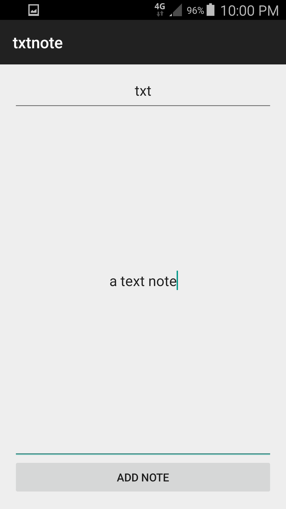
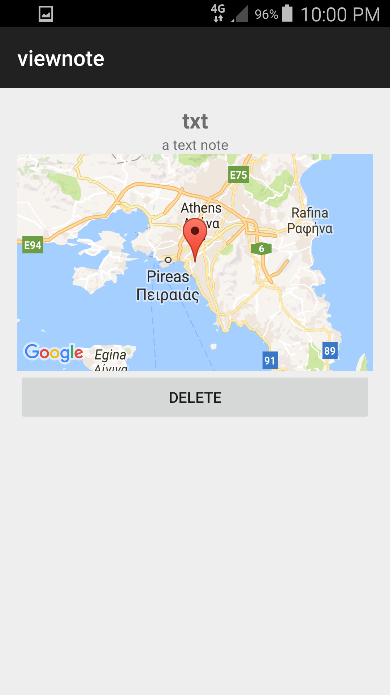
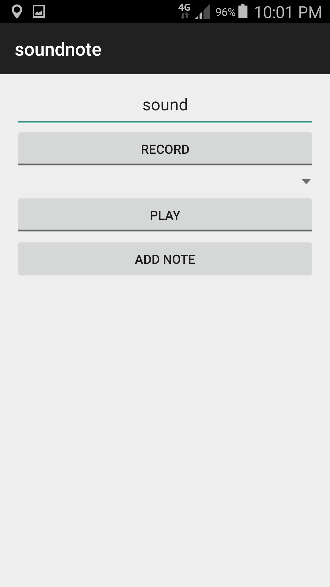
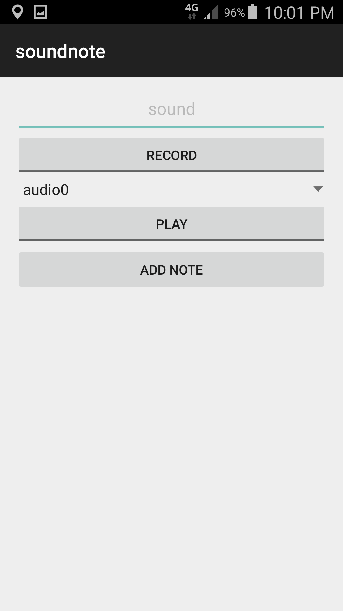
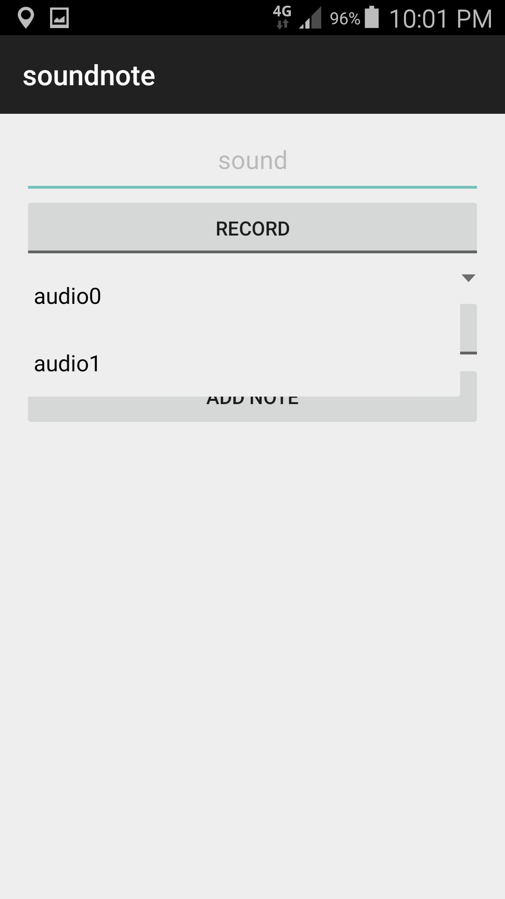
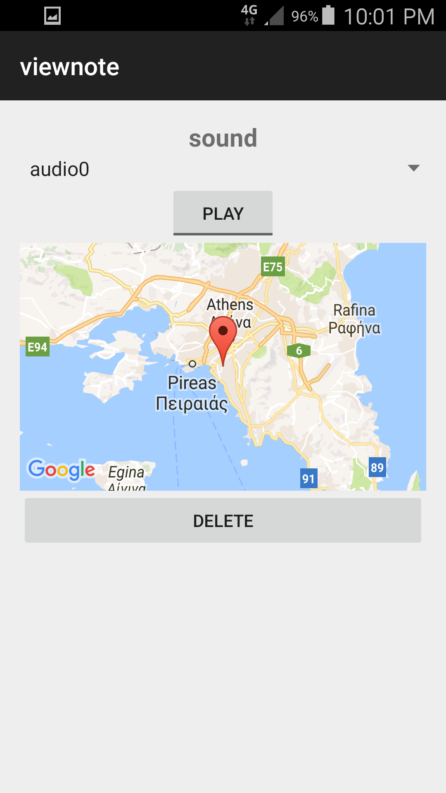
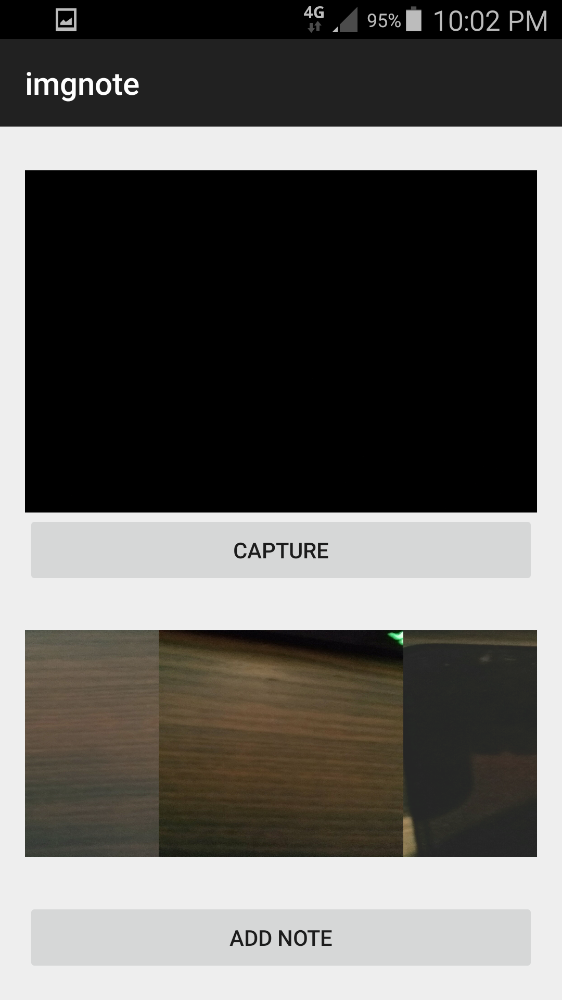
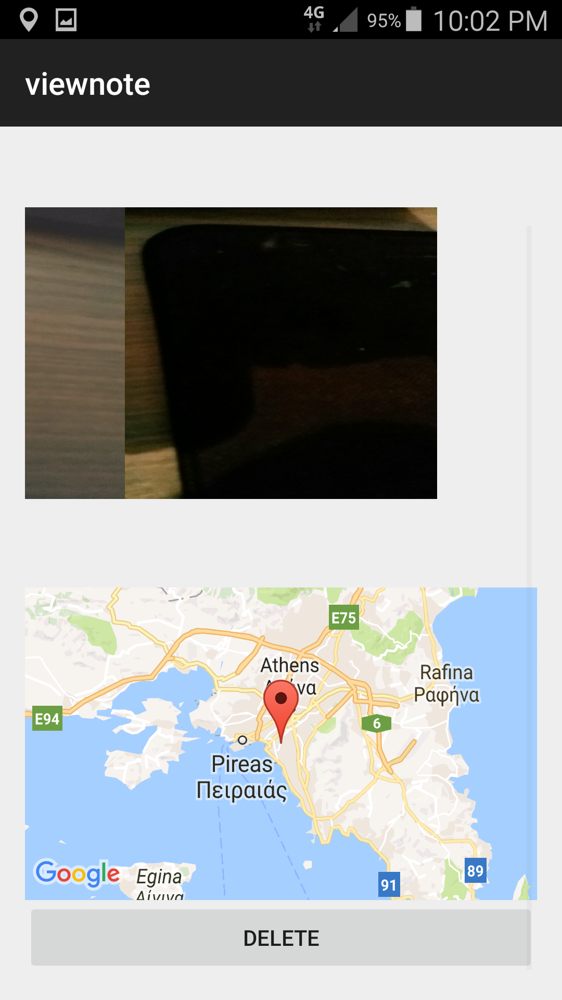
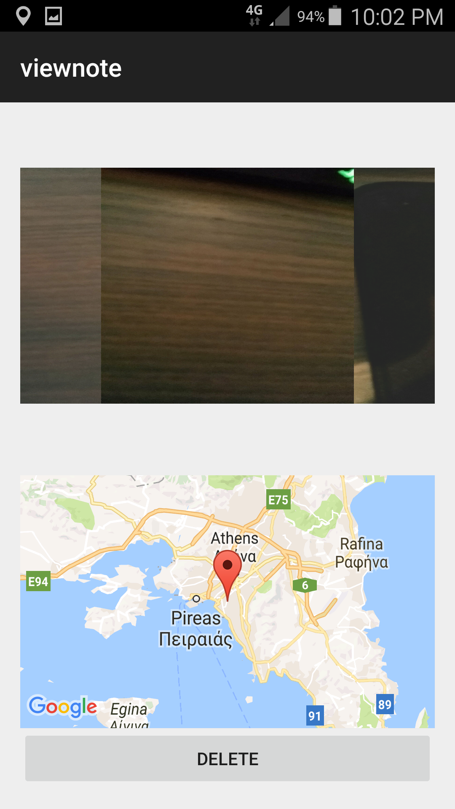

# GPS-Memo-App
Keeps text,sound,image memos along with coordinates to display Google Map of where memo was recorded

<html>

  <head>
  </head>

  <body>
  <h3>Main Activity</h3>
   

 
<h3>Add + view text note</h3>
 

 
  <h3>Add + listen to sound note</h3>
   

 
  <h3>Add + view image note</h3>
   

  </body>
</html>
